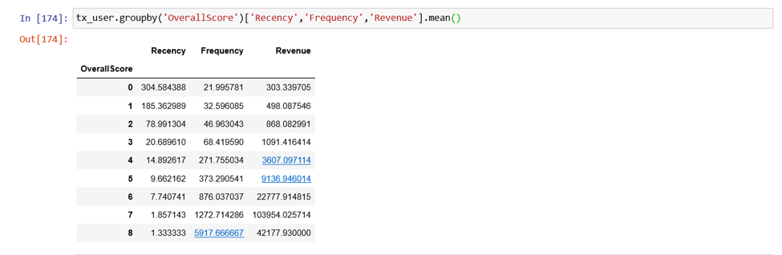

# Customer_Segmentation_RFM_Modelling_Python

Smart marketers understand the importance of “know thy customer.” Instead of simply focusing on generating more clicks, marketers must follow the paradigm shift from increased CTRs (Click-Through Rates) to retention, loyalty, and building customer relationships.
Instead of analyzing the entire customer base as a whole, it’s better to segment them into homogeneous groups, understand the traits of each group, and engage them with relevant campaigns rather than segmenting on just customer age or geography.
One of the most popular, easy-to-use, and effective segmentation methods to enable marketers to analyze customer behavior is RFM analysis.

## What is Recency, Frequency, Monetary Value (RFM) ?
Recency, frequency, monetary value is a marketing analysis tool used to identify a company's or an organization's best customers by using certain measures. The RFM model is based on three quantitative factors:
1.	Recency: How recently a customer has made a purchase
2.	Frequency: How often a customer makes a purchase
3.	Monetary Value: How much money a customer spends on purchases
### RFM analysis numerically ranks a customer in each of these three categories, generally on a scale of 1 to 5 (the higher the number, the better the result). The "best" customer would receive a top score in every category.

## KEY TAKEAWAYS
•	Recency, frequency, monetary value (RFM) a marketing analysis tool used to identify a firm's best clients, based on the nature of their spending habits.
•	An RFM analysis evaluates clients and customers by scoring them in three categories: how recently they've made a purchase, how often they buy, and the size of their purchases.
•	RFM analysis helps firms reasonably predict which customers are more likely to make purchases again in the future, how much revenue comes from new (versus repeat clients), and how to turn occasional buyers into habitual ones.

Customers who use your platform have different needs and they have their own different profile. You should adapt your actions depending on that.

You can do many different segmentations according to what you are trying to achieve. If you want to increase retention rate, you can do a segmentation based on churn probability and take actions. But there are very common and useful segmentation methods as well. Now we are going to implement one of them to our business: RFM.

As the methodology, we need to calculate Recency, Frequency and Monetary Value (we will call it Revenue from now on) and apply unsupervised machine learning to identify different groups (clusters) for each. Let’s jump into coding and see how to do RFM Clustering.

### Example - Customer Segmentation - RFM
For this example, will again use same data set used for Customer Metric Modeling [online retail data].
Now we will use python libraries to calculate Recency, Frequency, Monetary score for each individual customer.

 

Please refer python code for better understanding & visualization.

Thanx 😊

